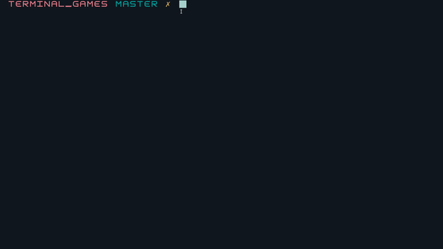
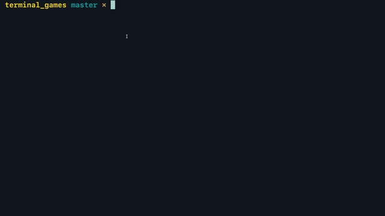
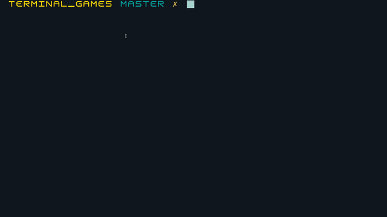
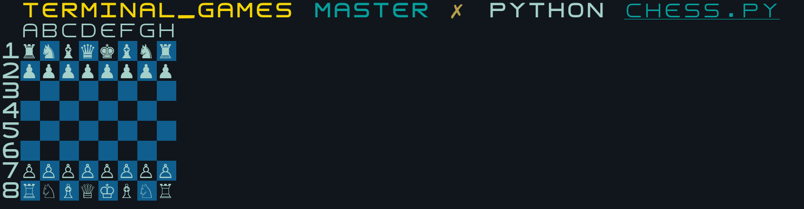

# Terminal games

This repository serves as a home to many terminal games written with [blessed](https://github.com/jquast/blessed).
Some have an upstream, like [typing_test](https://github.com/MasterMedo/typetest), and others were created as a 1 hour challenge (`tetris`, `jump`, `tic-tac-toe`).
It is advised to use equal height and width (square/block/geometric) fonts.

# Showcase

### tetris


### typing_test


### hangman


### tic-tac-toe


# A sneak peek of what's comming

### Chess


# Setup

```
pip3 install blessed
python typing_test.py
```
